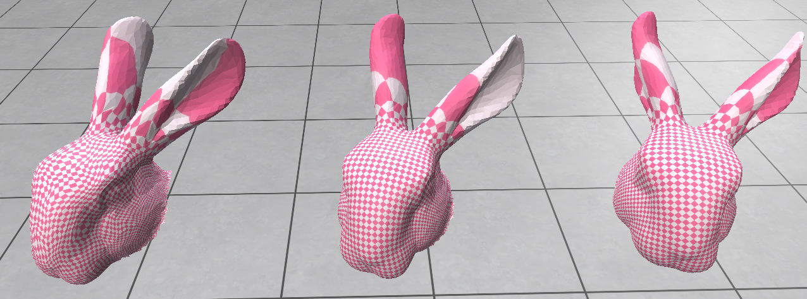
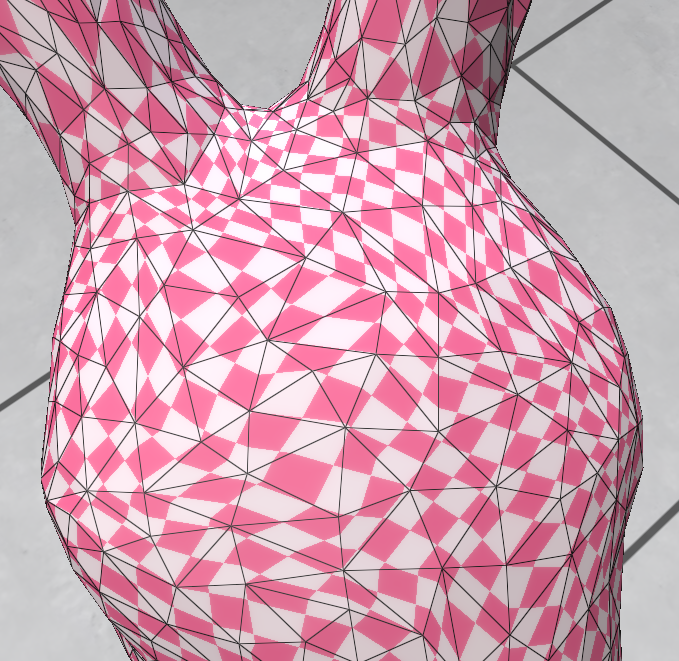
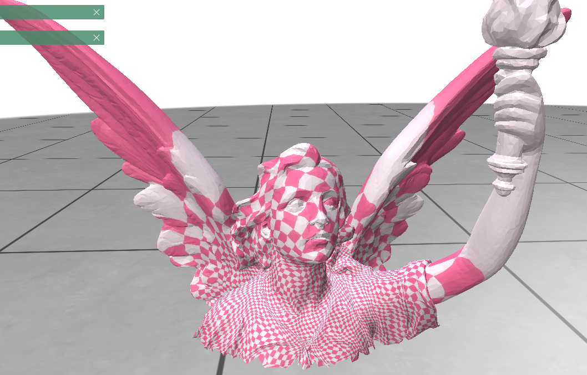
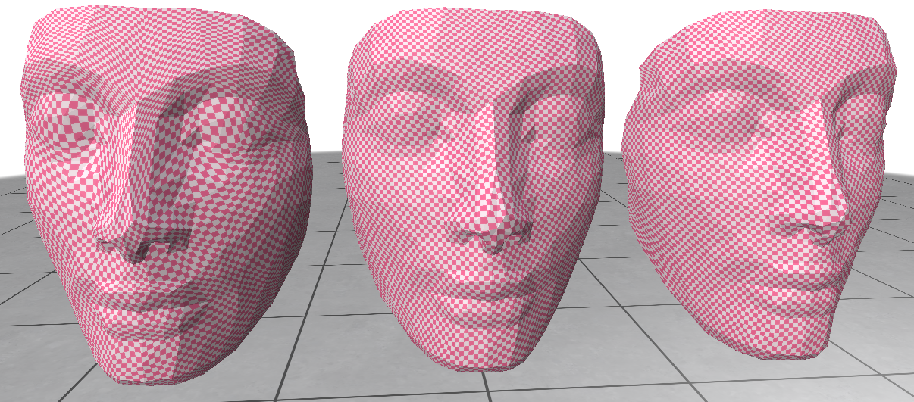
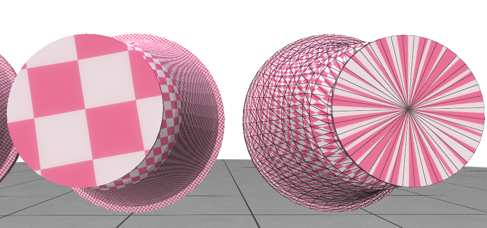
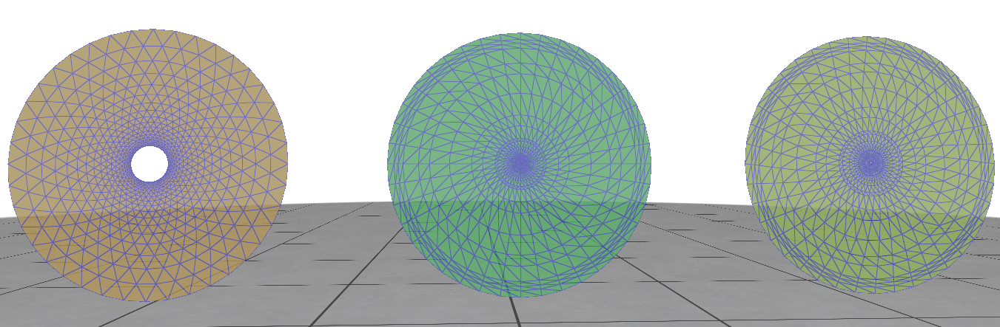
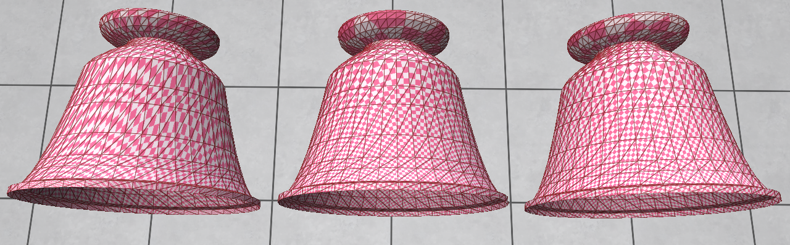
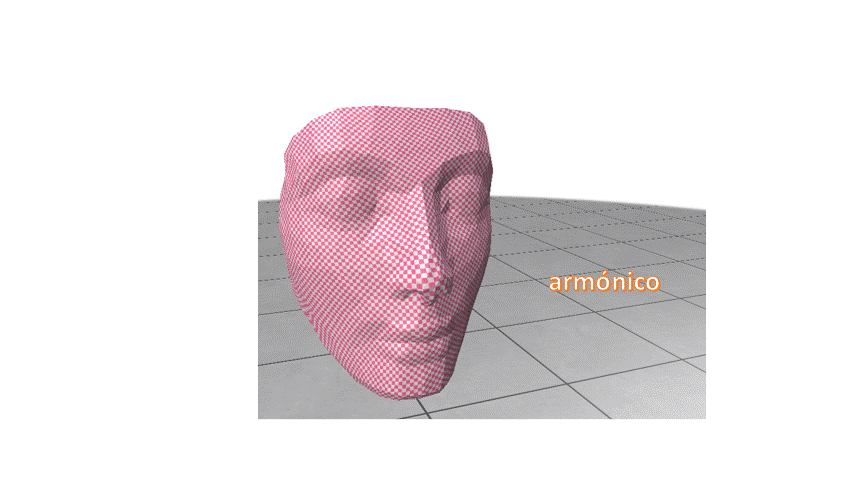
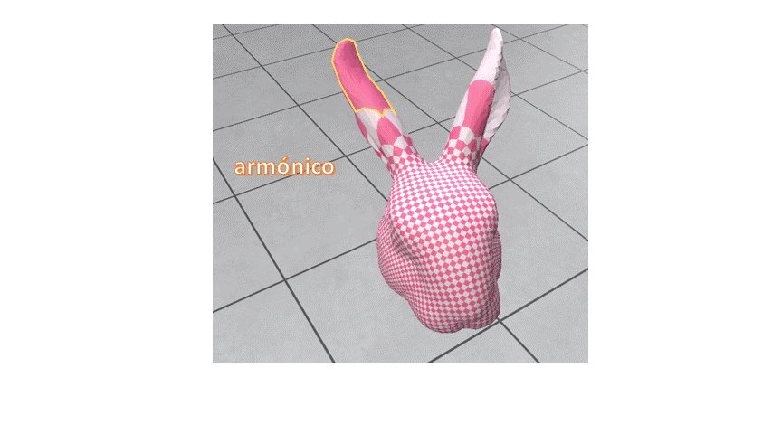
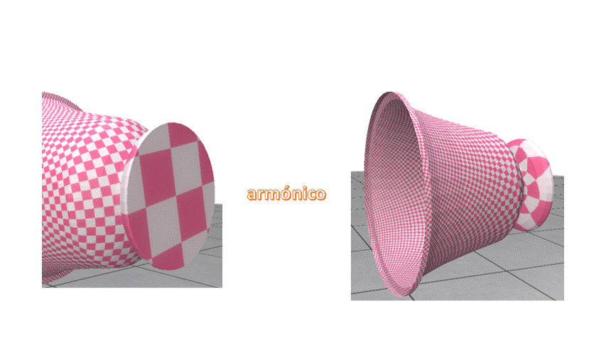

# CC5513-T3-Parametrizacion
Código desarrollado como parte de una tarea del ramo CC5513, Procesamiento geométrico y análisis de formas, dictado por el profesor Iván Sipirán en la Universidad de Chile

### Objetivo y Metodología
La parametrización con borde fijo se basa en conceptos de conservación de energía al realizar el mapping del espacio 3D 
al 2D. Para aquello, se debe considerar los pesos que los vértices tuvieran inicialmente. El propósito de esta 
implementación es comparar tres formas distintas de asignación de pesos:
 - **Uniforme**: todos los vértices tienen el mismo peso (1 en este caso), independientemente de su información local.
 - **Armónico**: aplica una discretización del mapeo armónico, que involucra la suma de cotangentes vecinos
 - **Valor medio**: discretización similar al mapeo armónico que utiliza el teorema del valor medio, a la vez que intenta preservar características de la forma al considerar distancias

Para determinar cuál produce mapeos de mejor calidad visual. Para esto, se visualizarán las diferencias en `polyscope` 
sobre 4 mallas en formato `.off`. 

Tres de ellas (bunny, lucy y nefertiti) fueron entregadas junto al enunciado. 
La cuarta (world_cut) fue extraída de [3D pottery dataset](http://www.ipet.gr/~akoutsou/benchmark/) (de la carpeta Krater) 
y modificado en MeshLab para que cumpliera con la condición de borde.
Esta última malla tiene la propiedad de tener triángulos menos uniformes en cuanto a área y a ser una triangulación de menor calidad en ángulos.

### Ejecución del Código
El programa principal `main.py` se ejecuta desde la línea de comandos.

Con el parámetro `--file [ARCHIVO]` se especifica la ruta del archivo a utilizar. Las mallas de prueba están en la carpeta `data` de este repositorio. Por defecto se usa `bunny.off`

Se pueden escoger tres formas de renderizar los resultados comparativos en `polyscope`. El usuario puede escoger el más conveniente según lo que se quiera observar: 
 - `--show_three`: muestra tres copias de la malla de entrada, cada una mostrando parametrizaciones que usan las distintas asignaciones de pesos. De izquierda a derecha se muestran: uniforme, armónica y valor medio. Apoya para contrastar grandes diferencias con los modelos lado a lado.
 - `--harmonic_vs_mean`: empíricamente y con cada figura, se observó que el método que presenta más diferencias visibles es el uniforme. No pasa así con los métodos armónicos y de valor medio. Esta opción renderiza dos copias del modelo superpuestos con los métodos anteriores complicados. Se puede activar y desactivar el render de la malla armónica desde polyscope para apreciar los cambios.
 - `--show_only_one`: muestra únicamente una copia del modelo, por si se desea omitir la comparación. Se debe especificar el método a utilizar mediante el parámetro `--weight METHOD`, en donde `METHOD` debe ser `uniform`, `harmonic` o `mean_value`

En todos los casos, frente al modelo 3D, se muestra el círculo sobre el cuál se mapearon las coordenadas baricéntricas.
Si se desea que estos círculos aparezcan invisibles, se puede proveer del flag `--hide_barycentric`

### Resultados Empíricos

#### Pesos Uniformes

En la imagen de arriba, se pueden apreciar los resultados de aplicar pesos uniformes, armónicos y valor medio, de izquierda a derecha, al conejo. 
Las mayores distinciones se aprecian en los pesos uniformes, pues se ve mucho más distorsionado que los últimos dos métodos.

Como se observa al hacerle zoom, los pesos uniformes son sensibles a la forma de los triángulos, pues el patrón se ve más estirado sobre los triángulos más alargados
y más contraído en aquellos de menor área. En general, no es robusto a cambios de curvatura.

Distorsiones similares se observan en lucy.off

Aunque incluso en mallas donde hay menores cambios de curvatura, como el de Nefertiti, este método presenta diferencias grandes con los otros dos.
El patrón se deforma para seguir la dirección de la nariz y no preserva ángulos. El área es inconsistente en los ojos, donde es más grande

Tampoco funciona sobre mallas que que tengan triángulos de calidad, como en el caso de la base de la copa de world_cut.off.

Se observa también que la textura se distorsiona y colapsa en un punto. Esto se debe al hoyo creado en sus coordenadas baricéntricas.
También es interesante notar lo distinta que se ve la triangulación en el mapeo a los otros dos métodos.

Mientras que los métodos armónico y de valor medio preservan mejor cómo se veía la malla originalmente en su mapeo 2D (como cuadriláteros).

### Pesos Armónicos vs Valor medio

En cuerpos más planares, como el de nefertiti, las diferencias son poco apreciables. Ambos métodos serían adecuados para realizar la parametrización

Mientras que en cuerpos  que no son inyectivos y tienen protuberancias que se salen del contorno del borde, las texturas se distorsionan más al alejarse del mismo.
Aún así, aquí se destaca el método de valor medio por intentar mantener las áreas de la textura lo más uniforme posible, y disminuir la distorsión en relación al método armónico